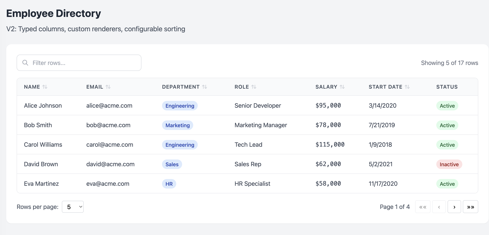

# DataTable V2 - Vite React + TypeScript + Vitest

A fully-featured, type-safe DataTable component with filtering, sorting, and pagination capabilities, built with React, TypeScript, and comprehensive Vitest testing.

## 📸 Screenshots

### Application Demo

*DataTable component with filtering, sorting, pagination, and custom renderers for employee data*

### Vitest Testing

*78 tests passing with 100% coverage on all utility functions*

---

## 🚀 Quick Start

### Installation
```bash
npm install
```

### Development
```bash
npm run dev
```
Visit http://localhost:5173 (or the port shown in terminal)

### Testing
```bash
# Run all tests
npm run test

# Run tests with UI
npm run test:ui

# Run tests with coverage
npm run test:coverage
```

### Build
```bash
npm run build
npm run preview
```

---

## 📁 Project Structure

```
v2/
├── src/
│   ├── components/
│   │   └── DataTable/
│   │       ├── DataTable.tsx          # Main component
│   │       └── index.ts               # Barrel export
│   ├── utils/
│   │   ├── filtering.ts               # Filter logic (17 tests)
│   │   ├── filtering.test.ts
│   │   ├── sorting.ts                 # Sort logic (25 tests)
│   │   ├── sorting.test.ts
│   │   ├── pagination.ts              # Pagination logic (36 tests)
│   │   └── pagination.test.ts
│   ├── types/
│   │   └── dataTable.types.ts         # TypeScript interfaces
│   ├── data/
│   │   ├── sampleEmployees.ts         # Sample employee data
│   │   └── employeeColumns.tsx        # Column definitions
│   ├── App.tsx                        # Demo application
│   ├── main.tsx                       # Entry point
│   └── index.css                      # Tailwind styles
├── vite.config.ts                     # Vite + Vitest config
├── tsconfig.json                      # TypeScript config
├── tailwind.config.js                 # Tailwind config
└── package.json
```

---

## 🧪 Testing

### Test Coverage
- **78 tests** passing across all utilities
- **100% code coverage** for:
  - `filtering.ts` - Multi-column search, null handling
  - `sorting.ts` - Numeric, date, string sorting
  - `pagination.ts` - Page calculations and slicing

### Test Categories

#### Filtering Tests (17 tests)
- ✅ Empty/whitespace handling
- ✅ Case-insensitive matching
- ✅ Multi-column search
- ✅ Null/undefined value handling
- ✅ Special characters and edge cases

#### Sorting Tests (25 tests)
- ✅ Numeric sorting (integers, decimals, negatives)
- ✅ Date parsing and sorting
- ✅ String comparison (case-insensitive, locale-aware)
- ✅ Null handling (nulls first in asc, last in desc)
- ✅ Sort state transitions (asc → desc → none)

#### Pagination Tests (36 tests)
- ✅ Total pages calculation
- ✅ Page clamping to valid range
- ✅ Data slicing for each page
- ✅ Edge cases (empty data, single item, large datasets)
- ✅ Data immutability

---

## ✨ Features

### DataTable Component
- **Generic Type Support** - Works with any data type extending `BaseRow`
- **Filtering** - Real-time search across all columns
- **Sorting** - Click headers to cycle through sort states
- **Pagination** - Customizable page sizes with navigation controls
- **Custom Renderers** - Define custom rendering for any column
- **Responsive Design** - Mobile-friendly with Tailwind CSS
- **Accessibility** - ARIA attributes for screen readers
- **TypeScript** - Full type safety with strict mode

### Column Configuration
```typescript
const columns: ColumnDef<Employee>[] = [
  { key: 'name', header: 'Name', width: '180px' },
  { key: 'email', header: 'Email' },
  {
    key: 'salary',
    header: 'Salary',
    render: (value) => `$${Number(value).toLocaleString()}`
  },
  {
    key: 'status',
    header: 'Status',
    sortable: false  // Disable sorting for this column
  }
];
```

---

## 🎯 Edge Cases Handled

- ✅ Empty data sets → Shows "No data available"
- ✅ No filter matches → Shows "No matching rows found"
- ✅ Page overflow → Current page auto-clamped to valid range
- ✅ Null/undefined values → Sorted consistently, excluded from search
- ✅ Mixed data types → Numbers, dates, strings all sorted correctly
- ✅ Sort cycling → asc → desc → none (clear sort)
- ✅ Filter/page size changes → Auto-reset to page 1
- ✅ Non-sortable columns → Opt-out via `sortable: false`
- ✅ Custom rendering → Full control over cell display
- ✅ Accessible → ARIA labels and semantic HTML

---

## 🛠️ Technologies

- **React 18** - UI library
- **TypeScript 5** - Type safety with strict mode
- **Vite 6** - Fast build tool and dev server
- **Vitest 2** - Unit testing framework
- **Tailwind CSS 3** - Utility-first styling
- **Happy-DOM** - Lightweight DOM for testing

---

## 📊 How to Capture Screenshots

See [SCREENSHOT-GUIDE.md](SCREENSHOT-GUIDE.md) for detailed instructions.

**Quick steps:**

1. **Application screenshot** (`screenshots/app-main.png`):
   ```bash
   npm run dev  # Visit http://localhost:5175
   ```
   Capture full page showing table, filter, pagination, and edge cases

2. **Vitest UI screenshot** (`screenshots/vitest-ui.png`):
   ```bash
   npm run test:ui  # Visit http://localhost:51204/__vitest__/
   ```
   Capture showing 78 tests passing with coverage

---

## 📝 Usage Example

```tsx
import { DataTable } from './components/DataTable';

interface User {
  id: number;
  name: string;
  email: string;
  age: number;
}

const users: User[] = [
  { id: 1, name: 'Alice', email: 'alice@example.com', age: 30 },
  { id: 2, name: 'Bob', email: 'bob@example.com', age: 25 },
];

const columns = [
  { key: 'name', header: 'Name' },
  { key: 'email', header: 'Email' },
  { key: 'age', header: 'Age' }
];

function App() {
  return (
    <DataTable
      data={users}
      columns={columns}
      initialPageSize={10}
      pageSizeOptions={[5, 10, 20, 50]}
    />
  );
}
```

---

## 🔧 Configuration

### Vite Config
- React plugin enabled
- Vitest integration with Happy-DOM
- Coverage reporting with v8

### TypeScript Config
- Strict mode enabled
- No unused locals/parameters
- No unchecked indexed access

### Tailwind Config
- Content paths configured for all source files
- Default theme with no customizations

---

## 📄 License

MIT

---

## 🤝 Contributing

This is a demo project showcasing best practices for:
- Component architecture with TypeScript
- Utility function extraction for testability
- Comprehensive unit testing with Vitest
- Type-safe generic components
- Edge case handling

Feel free to use this as a reference or template for your own projects!

---

**Built with ❤️ using Vite + React + TypeScript + Vitest**
