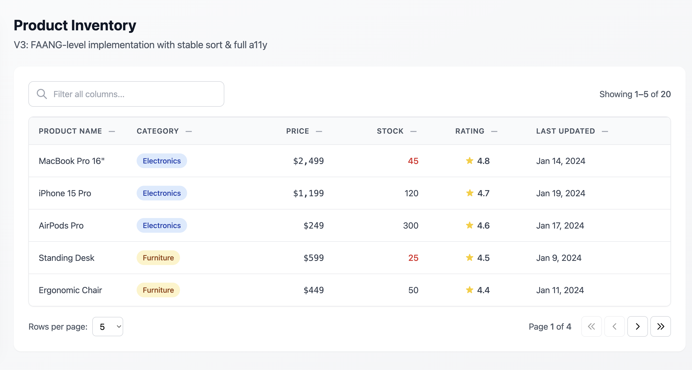

# Screenshots

This document contains screenshots demonstrating the DataTable component and test coverage.

## Main Interface

The DataTable component features:
- **Filtering**: Real-time search across all columns
- **Sorting**: Clickable column headers with visual indicators (↑↓)
- **Pagination**: Configurable page sizes with navigation controls
- **Responsive Design**: Tailwind CSS styling with hover effects
- **Accessibility**: Full ARIA support and keyboard navigation



### Key Features Visible:
1. **Search Bar**: Filter input at the top with search icon and clear button
2. **Data Table**: Clean table layout with product inventory data
3. **Column Headers**: Sortable headers with sort indicators
4. **Styled Content**:
   - Category badges with color coding (Electronics: blue, Furniture: amber, Accessories: gray)
   - Price formatting with monospace font
   - Stock warnings for low inventory (red text)
   - Star ratings with icons
   - Formatted dates
5. **Pagination Controls**:
   - Rows per page selector (5, 10, 20 options)
   - Page information (showing X-Y of Z)
   - Navigation buttons (First, Previous, Next, Last)
6. **Results Summary**: Display showing filtered/total counts

---

## Vitest UI - Test Coverage

The project uses Vitest for testing with comprehensive test suites covering:
- Component rendering
- Sorting functionality (stable sort algorithm)
- Filtering behavior
- Pagination logic
- Edge cases and accessibility


### Test Structure:
```
DataTable/
├── DataTable.test.tsx              # Main component tests
├── DataTable.sorting.test.tsx      # Sorting behavior tests
├── DataTable.filtering.test.tsx    # Filter functionality tests
├── DataTable.pagination.test.tsx   # Pagination tests
└── DataTable.utils.test.ts         # Utility function tests
```

### Test Coverage Highlights:
- **Component Tests**: Rendering, headers, data display, empty states
- **Sorting Tests**: Ascending/descending order, stable sort, null handling
- **Filtering Tests**: Search functionality, case-insensitivity, clear filter
- **Pagination Tests**: Page navigation, page size changes, boundary conditions
- **Utility Tests**: Compare functions, clamp utility

---

## How to Capture Screenshots

### 1. Main Interface Screenshot

Start the development server:
```bash
npm run dev
```

Then:
1. Open http://localhost:5173 in your browser
2. The application should display the Product Inventory table
3. Take a full-page screenshot showing:
   - The header ("Product Inventory")
   - The search/filter bar
   - The data table with several rows visible
   - The pagination controls at the bottom
4. Save as `screenshots/main-interface.png`

**Optional**: Demonstrate different states:
- `main-interface-filtered.png` - Screenshot with active filter
- `main-interface-sorted.png` - Screenshot with column sorted
- `main-interface-empty.png` - Screenshot showing empty state

### 2. Vitest UI Screenshot

Start the Vitest UI:
```bash
npm run test:ui
```

Then:
1. Open the Vitest UI in your browser (typically http://localhost:51204/__vitest__/)
2. Ensure all tests are visible in the sidebar
3. Take a screenshot showing:
   - The test file list on the left
   - The test results (all passing with green checkmarks)
   - Any expanded test suite showing individual test cases
4. Save as `screenshots/vitest-ui.png`

**Optional Coverage View**:
```bash
npm run test:coverage
```
- Take a screenshot of the coverage report showing high test coverage
- Save as `screenshots/test-coverage.png`

---

## Technical Implementation Notes

### TypeScript Configuration
- Uses `verbatimModuleSyntax: true` for explicit type imports
- All type-only imports use `import type` syntax
- Strict type checking enabled

### Component Architecture
- Generic type parameter `<T extends RowData>` for type safety
- Stable sort algorithm with index tiebreaker
- Data flow: Filter → Sort → Paginate
- Memoized computations for performance

### Accessibility Features
- ARIA labels and live regions
- Keyboard navigation support
- Screen reader announcements
- Semantic HTML structure

---

## Repository Structure

```
data-table-vitest/
├── src/
│   ├── components/
│   │   └── DataTable/
│   │       ├── DataTable.tsx          # Main component
│   │       ├── DataTable.types.ts     # Type definitions
│   │       ├── DataTable.utils.ts     # Utility functions
│   │       └── __tests__/             # Test suites
│   ├── data/
│   │   └── sampleData.tsx             # Sample product data
│   ├── App.tsx                        # App wrapper
│   └── main.tsx                       # Entry point
├── screenshots/                        # This directory for screenshots
├── package.json
├── vite.config.ts
├── tsconfig.json
├── tailwind.config.js
└── README.md
```

---

## Notes

After capturing screenshots, make sure to:
1. Save them in the `screenshots/` directory
2. Use PNG format for best quality
3. Optimize file sizes if needed
4. Update this document if you add additional screenshots
